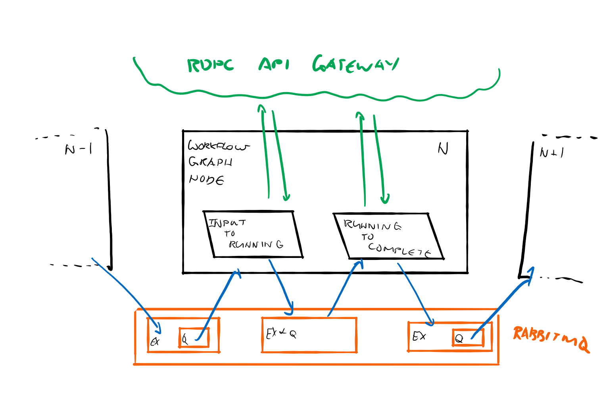

# workflow-graph-node
Workflow Graph Node

## Description
The generic component for workflow graph that allows the execution of workflows from an incoming event stream.
In addition to running the workflows, the responsibilities of this component also include shepherding them to completion
and producing output to another message queue.  

## Technology
- Java 11 on GraalVM
- Spring Boot
    - Webflux
- RabbitMQ
- Reactor
- Reactor-RabbitMQ-Streams
- Avro
- Apollo GraphQL 

## Building
```bash
mvn clean package
```

## Running
```bash
mvn spring-boot:run
```

## Design

